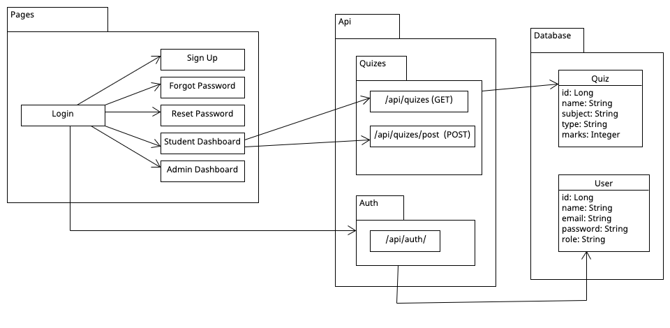
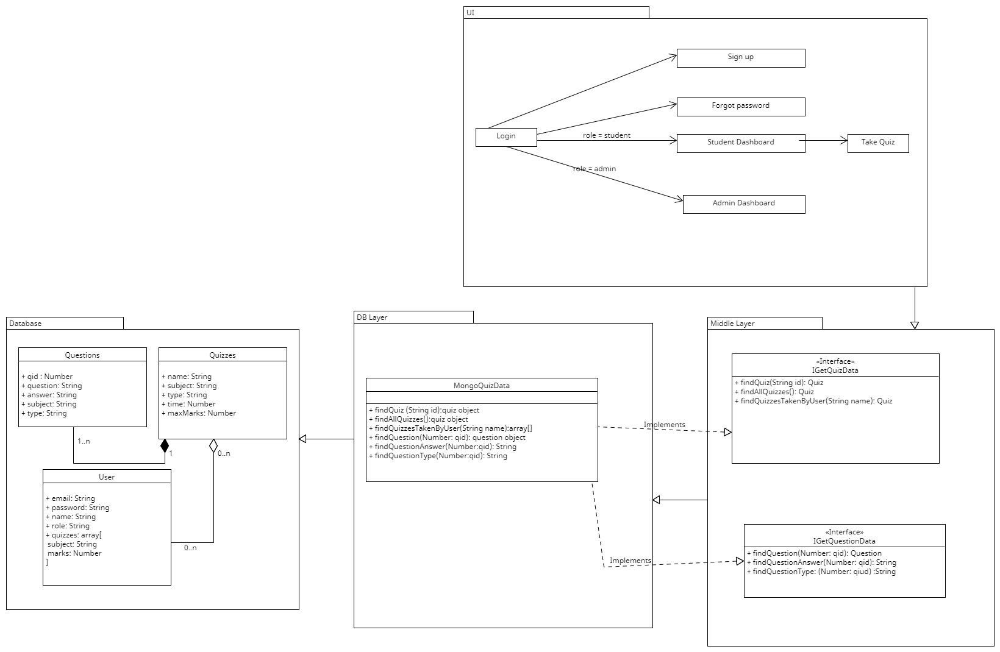
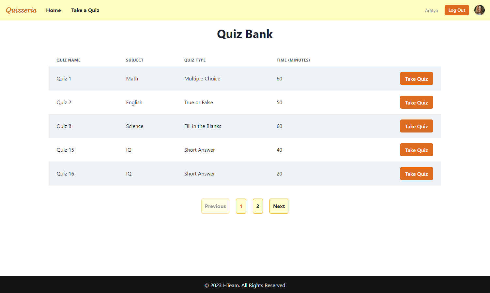
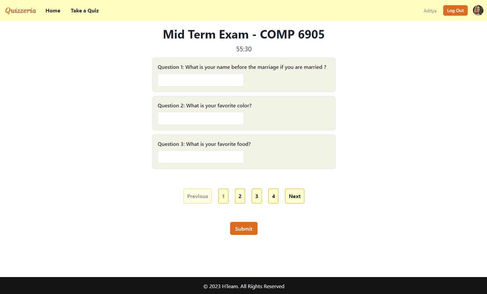

# Team H Quiz App

This readme contains details for the quiz app, team members, meeting minutes, how to run the code the UML diagrams, and the attributions section.

## Table of Contents

- [Team H Quiz App](#team-h-quiz-app)
  - [Table of Contents](#table-of-contents)
  - [Description](#description)
  - [Technologies Used](#technologies-used)
  - [Team Members \& Roles](#team-members--roles)
  - [Meeting Minutes](#meeting-minutes)
  - [Team Processes](#team-processes)
  - [Individual Contributions](#individual-contributions)
  - [How To Run](#how-to-run)
    - [Credentials to Use](#credentials-to-use)
  - [UML Diagrams](#uml-diagrams)
  - [What works?](#what-works)
  - [Performance Review](#performance-review)
  - [Issue Tracker or Kanban Board](#issue-tracker-or-kanban-board)
  - [Attributions](#attributions)

## Description

The project comprises a quiz app where students can log in or sign up to the portal and take or retake quizzes and see their marks displayed. There is also an option for an admin. The admin can create, delete, and update quizzes.

As of this moment, this is a web-based application.

## Technologies Used

The following is the list of technologies that have been used in building this project.

- MongoDB
- Next.js
- NextAuth
- Typescript
- Javascript
- React
- Chakra UI

## Team Members & Roles


<table>
  <tr>
   <td><strong>Member Name</strong>
   </td>
   <td><strong>Member Student ID</strong>
   </td>
   <td><strong>Member Role</strong>
   </td>
  </tr>
  <tr>
   <td>Adithya 
   </td>
   <td><strong>202292768</strong>
   </td>
   <td><strong>Team Facilitator</strong>
<p>
<strong>Back-End Developer</strong>
   </td>
  </tr>
  <tr>
   <td>Mehadi
   </td>
   <td><strong>202287115</strong>
   </td>
   <td><strong>Back-End Developer</strong>
   </td>
  </tr>
  <tr>
   <td>Majid
   </td>
   <td><strong>202292752</strong>
   </td>
   <td><strong>Database Logic & Backend Developer</strong>
   </td>
  </tr>
  <tr>
   <td>Heshani
   </td>
   <td><strong>202292233</strong>
   </td>
   <td><strong>Front-End Developer</strong>
   </td>
  </tr>
  <tr>
   <td>Sumrish
   </td>
   <td><strong>202196728</strong>
   </td>
   <td><strong>Front-End Developer & Designer</strong>
   </td>
  </tr>
</table>

## Meeting Minutes

The following are links to the meeting minutes.

### Sprint 1

- [23 Feb 2023](docs/Meeting%20Minutes/Meeting_Minutes_23-Feb-2023.md)
- [03 Mar 2023](docs/Meeting%20Minutes/Meeting_Minutes_03-March-2023.md)
- [05 Mar 2023](docs/Meeting%20Minutes/Meeting_Minutes_05-March-2023.md)
- [07 Mar 2023](docs/Meeting%20Minutes/Meeting_Minutes_07-March-2023.md)
- [10 Mar 2023](docs/Meeting%20Minutes/Meeting_Minutes_10-March-2023.md)

### Sprint 2

- [14 Mar 2023](docs/Meeting%20Minutes/Meeting_Minutes_14-March-2023.md)
- [16 Mar 2023](docs/Meeting%20Minutes/Meeting_Minutes_16-March-2023.md)
- [17 Mar 2023](docs/Meeting%20Minutes/Meeting_Minutes_17-March-2023.md)
- [20 Mar 2023](docs/Meeting%20Minutes/Meeting_Minutes_20-March-2023.md)
- [25 Mar 2023](docs/Meeting%20Minutes/Meeting_Minutes_25-March-2023.md)
- [29 Mar 2023](docs/Meeting%20Minutes/Meeting_Minutes_29-March-2023.md)

## Team Processes

Details regarding the team contributions and team processes can be found [here](docs/Team%20Processes/Team_Processes.md)

## Individual Contributions

The individual contributions for each team member can be found here:

- [Adithya](docs/Individual%20Contributions/Adithya_Sudhan.md)
- [Mehadi](docs/Individual%20Contributions/Mehadi_Hassan.md)
- [Majid](docs/Individual%20Contributions/Majid_Khan_Burki.md)
- [Heshani](docs/Individual%20Contributions/Heshani_Hattiarachchi.md)
- [Sumrish](docs/Individual%20Contributions/Sumrish_Hanif.md)

<table>
    <tr>
        <td>Name</td>
        <td>Issue</td>
        <td>Merged to Master?</td>
    </tr>
    <tr>
        <td>[Adi](#)</td>
        <td>Issue 1</td>
        <td>Yes</td>
    </tr>
    <tr>
        <td></td>
        <td>Issue 2</td>
        <td>Yes</td>
    </tr>
    <tr>
        <td></td>
        <td>Issue 3</td>
        <td>Yes</td>
    </tr>
    <tr>
        <td>[Majid](#)</td>
        <td>Issue 1</td>
        <td>No</td>
    </tr>
    <tr>
        <td></td>
        <td>Issue 2</td>
        <td>No</td>
    </tr>
    <tr>
        <td></td>
        <td>Issue 3</td>
        <td>No</td>
    </tr>
    <tr>
        <td>Mehadi</td>
        <td>Implement User Session (https://github.com/MUN-COMP6905/project-hteam/issues/87)</td>
        <td>Yes</td>
    </tr>
    <tr>
        <td></td>
        <td>Adding backend functionalities for &quot;Quiz Bank&quot; (https://github.com/MUN-COMP6905/project-hteam/issues/104)</td>
        <td>Yes</td>
    </tr>
    <tr>
        <td></td>
        <td>Integrate Student Dashboard and Quizbank with the backend (https://github.com/MUN-COMP6905/project-hteam/issues/120)</td>
        <td>Yes</td>
    </tr>
    <tr>
        <td></td>
        <td>Wrting Unit Test for DB Connection and Other Classes (https://github.com/MUN-COMP6905/project-hteam/issues/126)</td>
        <td>Yes</td>
    </tr>
    <tr>
        <td>Sumrish</td>
        <td>Create a Figma UI for Quiz Results Screen (https://github.com/MUN-COMP6905/project-hteam/issues/81)</td>
        <td>Yes</td>
    </tr>
    <tr>
        <td></td>
        <td>Implementation of Quiz Result UI for students (https://github.com/MUN-COMP6905/project-hteam/issues/83)</td>
        <td>Yes</td>
    </tr>
    <tr>
        <td></td>
        <td>Modification of SignUp Page and Forgot Password Pages. Added documentation for user flow UI. (https://github.com/MUN-COMP6905/project-hteam/issues/99)</td>
        <td>Yes</td>
    </tr>
    <tr>
        <td></td>
        <td>Add tests for Sign Up page (https://github.com/MUN-COMP6905/project-hteam/issues/110)</td>
        <td>Yes</td>
    </tr>
    <tr>
        <td></td>
        <td>Add tests for Login Page (https://github.com/MUN-COMP6905/project-hteam/issues/111)</td>
        <td>Yes</td>
    </tr>
    <tr>
        <td></td>
        <td>Add tests for forgot password flow (https://github.com/MUN-COMP6905/project-hteam/issues/113)</td>
        <td>Yes</td>
    </tr>
    <tr>
        <td>Heshani</td>
        <td>Design wireframes for Take a Quiz UI (https://github.com/MUN-COMP6905/project-hteam/issues/76)</td>
        <td>Yes</td>
    </tr>
    <tr>
        <td></td>
        <td>Implement Quiz Bank UI for students (https://github.com/MUN-COMP6905/project-hteam/issues/45)</td>
        <td>Yes</td>
    </tr>
     <tr>
        <td></td>
        <td>Implement Take a Quiz UI for students (https://github.com/MUN-COMP6905/project-hteam/issues/77)</td>
        <td>Yes</td>
    </tr>
     <tr>
        <td></td>
        <td>Add Pagination for Student Dashboard (https://github.com/MUN-COMP6905/project-hteam/issues/116)</td>
        <td>Yes</td>
    </tr>
     <tr>
        <td></td>
        <td>Test Cases for UI in Student Screens (https://github.com/MUN-COMP6905/project-hteam/issues/129)</td>
        <td>Yes</td>
    </tr>
</table>

## How To Run

### On the cloud

Simply visit our [codesandbox deployment](https://0nz1td-3000.csb.app/) and use [these](#credentials-to-use) credentials. 

### Locally

To run the code locally, you’ll need to define your environment variables through the `.env.local` file or creating a `.env` file first. For a sample `.env` file, refer to `.env.example`. Use the same mongodb url (since it is set to the team mongodb instance url) and use your appropriate localhost url for the nextauth and host keys.

Once done, go to your console and run the following commands in the order specified.

This command will install all the prerequisite packages defined in the `package.json` file required to run the project.

```javascript

npm install 
```

This command will run the project in dev mode:

```javascript

npm run dev

```

### Credentials to Use

Sign in with the credentials: `username: Adi@Adi.com` and  `password: 4321`.

## UML Diagrams

Previous UML diagram for Sprint 02 


Previous UML diagram for Sprint 02


## What works?

- The user starts at the landing page.
- Signs in with the credentials: `username: Adi@Adi.com` and  `password: 4321`.
- User will arrive at the `/Students` page where scored quizzes will be visible.
- Clicking the `Retake Quiz` button will reset the score to -1.

## Available Screens for students

1. Student Dashboard
- This is the initial screen for a student logged in to the system successfully.<br/>


2. Student Quiz Bank
- This is the second tab in the Main Menu.
- This contains unattempted quizzes for the student logged in. 
- Student can select a quiz and attempt the quiz by clicking on the "Take Quiz" button along with it. <br/>


3. Student - Take a Quiz
- When a student clicks on the "Take a Quiz" button after picking a quiz to attempt, that student is redirected to this screen. 
- The default quiz contains short answer questions. <br/>



## Performance Review

You can find the performance reviews [here](docs/Performance%20Review/Review.pdf)
## Issue Tracker or Kanban Board

You can find the issue tracker/kanban board for the project [here](https://github.com/orgs/MUN-COMP6905/projects/11/).
## Attributions

Inspiration for this project was taken from the following resources:

- [Code Sandbox](https://codesandbox.io/)
- [Typescript and MongoDB App](https://github.com/danybeltran/nextjs-typescript-and-mongodb)
- [NextAuth.js](https://next-auth.js.org/)
- [Typescript](https://www.w3schools.com/typescript/)
- [Next.js](https://nextjs.org/)
- [Chakra UI](https://chakra-ui.com/getting-started)
- [Mongoose](https://mongoosejs.com/)
- [Quiza Redis](https://github.com/VinGitonga/quiza_redis)
- [Node.js](https://nodejs.org/en/)
