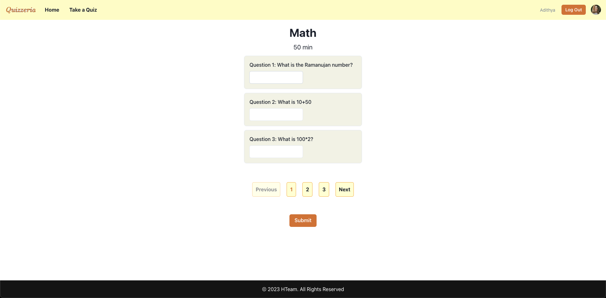
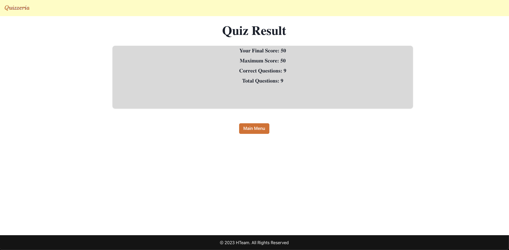

# Team H Quiz App

This readme contains details for the quiz app, team members, meeting minutes, how to run the code the UML diagrams, and the attributions section.

## Table of Contents

- [Team H Quiz App](#team-h-quiz-app)
  - [Table of Contents](#table-of-contents)
  - [Description](#description)
  - [Technologies Used](#technologies-used)
  - [Team Members \& Roles](#team-members--roles)
  - [Meeting Minutes](#meeting-minutes)
    - [Sprint 1](#sprint-1)
    - [Sprint 2](#sprint-2)
    - [Sprint 3](#sprint-3)
  - [Team Processes](#team-processes)
  - [Code Reviews Process](#code-reviews-process)
    - [Checklist for Code Review](#checklist-for-code-review)
      - [The Pull Request Process](#the-pull-request-process)
      - [Code Review Guidlines](#code-review-guidlines)
  - [Individual Contributions](#individual-contributions)
  - [How To Run](#how-to-run)
    - [On the cloud](#on-the-cloud)
    - [Locally](#locally)
    - [Credentials to Use](#credentials-to-use)
  - [UML Diagrams](#uml-diagrams)
  - [What works?](#what-works)
  - [Available Screens](#available-screens)
  - [Performance Review](#performance-review)
  - [Issue Tracker or Kanban Board](#issue-tracker-or-kanban-board)
  - [Attributions](#attributions)

## Description

The project comprises a quiz app where students can log in or sign up to the portal and take or retake quizzes and see their marks displayed. There is also an option for an admin. The admin can create, delete, and update quizzes.

As of this moment, this is a web-based application.

## Technologies Used

The following is the list of technologies that have been used in building this project.

- MongoDB
- Next.js
- NextAuth
- Typescript
- Javascript
- React
- Chakra UI
- Mocha

## Team Members & Roles


<table>
  <tr>
   <td><strong>Member Name</strong>
   </td>
   <td><strong>Member Student ID</strong>
   </td>
   <td><strong>Member Role</strong>
   </td>
  </tr>
  <tr>
   <td>Adithya</td>
   <td><strong>202292768</strong>
   </td>
   <td><strong>Team Facilitator</strong>
<p>
<strong>Back-End Developer</strong>
   </td>
  </tr>
  <tr>
   <td>Mehadi
   </td>
   <td><strong>202287115</strong>
   </td>
   <td><strong>Back-End Developer</strong>
   </td>
  </tr>
  <tr>
   <td>Majid
   </td>
   <td><strong>202292752</strong>
   </td>
   <td><strong>Database Logic & Backend Developer</strong>
   </td>
  </tr>
  <tr>
   <td>Heshani
   </td>
   <td><strong>202292233</strong>
   </td>
   <td><strong>Front-End Developer</strong>
   </td>
  </tr>
  <tr>
   <td>Sumrish
   </td>
   <td><strong>202196728</strong>
   </td>
   <td><strong>Front-End Developer & Designer</strong>
   </td>
  </tr>
</table>

## Meeting Minutes

The following are links to the meeting minutes.

### Sprint 1

- [23 Feb 2023](docs/Meeting%20Minutes/Meeting_Minutes_23-Feb-2023.md)
- [03 Mar 2023](docs/Meeting%20Minutes/Meeting_Minutes_03-March-2023.md)
- [05 Mar 2023](docs/Meeting%20Minutes/Meeting_Minutes_05-March-2023.md)
- [07 Mar 2023](docs/Meeting%20Minutes/Meeting_Minutes_07-March-2023.md)
- [10 Mar 2023](docs/Meeting%20Minutes/Meeting_Minutes_10-March-2023.md)

### Sprint 2

- [14 Mar 2023](docs/Meeting%20Minutes/Meeting_Minutes_14-March-2023.md)
- [16 Mar 2023](docs/Meeting%20Minutes/Meeting_Minutes_16-March-2023.md)
- [17 Mar 2023](docs/Meeting%20Minutes/Meeting_Minutes_17-March-2023.md)
- [20 Mar 2023](docs/Meeting%20Minutes/Meeting_Minutes_20-March-2023.md)
- [25 Mar 2023](docs/Meeting%20Minutes/Meeting_Minutes_25-March-2023.md)
- [29 Mar 2023](docs/Meeting%20Minutes/Meeting_Minutes_29-March-2023.md)

### Sprint 3

- [05 Apr 2023](docs/Meeting%20Minutes/Meeting_Minutes_05-April-2023.md)
- [12 Apr 2023](docs/Meeting%20Minutes/Meeting_Minutes_12-April-2023.md)

## Team Processes

Details regarding the team contributions and team processes can be found [here](docs/Team%20Processes/Team_Processes.md)

## Code Reviews Process

- A PR shall not be merged until all devs approve(either via commenting on the PR for code work and commenting on the story for non-code work)
- Any suggestions on the PR must be resolved before the PR can be merged.
- Code will be reviewed as per the DRY (Don't Repeat Yourself) and SOLID principles.

### Checklist for Code Review

#### The Pull Request Process

Once the branch is ready to merge in the master, a PR should be created for that and on the mean time the task from **in Progress**  will be moved to **Reviewed** on the kanboard.
Then the **request for changes** will be initiated on the same PR by adding comments to the PR, and have discussion related to that. Once the is changes the done, it's again committied on the same branch and the PR is updated accordingly.
Once all the suggestions/reviews are done, than **Approved** status is given to that PR, and it's moved from to **Done** tasks on the board.
Below is the rough draft of what's happening actually in terms of github.


(The figure has been collected from [here](https://www.swarmia.com/blog/a-complete-guide-to-code-reviews/))

#### Code Review Guidlines
To maintain code review standards across developers, it's a good idea to have guidelines for what to focus on in code reviews. Here's what we recommend focusing on:

**Functionality:** Does the code behave as the PR author likely intended? Does the code behave as users would expect?<br>
**Complexity:** Would another developer be able to easily understand and use the code?<br>
**Tests:** Does the PR have correct and well-designed automated tests?<br>
**Naming:** Are names for variables, functions, etc. descriptive?<br>
**Comments:** Are the comments clear and useful?<br>
**Documentation:** Did the author also update relevant documentation?<br>
Developers shouldn't spend their time reviewing things that can be automatically checked. Like for the pdf files or .md files, there's no need for this check list as it is specifically for the Dev tasks.

## Individual Contributions

The individual contributions for Assignment 4 / Sprint 3 of each team member can be found here:

- [Adithya](docs/Individual%20Contributions/Assignment%204/Adithya_Sudhan.md)
- [Mehadi](docs/Individual%20Contributions/Assignment%204/Mehadi_Hassan.md)
- [Majid](docs/Individual%20Contributions/Assignment%204/Majid_Burki.md)
- [Heshani](docs/Individual%20Contributions/Assignment%204/Heshani_Hettiarachchi.md)
- [Sumrish](docs/Individual%20Contributions/Assignment%204/Sumrish_Hanif.md)

<table>
    <tr>
        <td>Name</td>
        <td>Issue</td>
        <td>Merged to Master?</td>
    </tr>
    <tr>
        <td><a href = './docs/Individual%20Contributions/Assignment%204/Adithya_Sudhan.md'>Adithya</a>
        <td>Protect the master branch! (https://github.com/MUN-COMP6905/project-hteam/issues/149)</td>
        <td>Yes</td>
    </tr>
    <tr>
        <td></td>
        <td>Decouple data layer via a middle layer to conform to DDD paradigm (https://github.com/MUN-COMP6905/project-hteam/issues/165)</td>
        <td>Yes</td>
    </tr>
    <tr>
        <td><a href = './docs/Individual%20Contributions/Assignment%204/Majid_Burki.md'>Majid</a></td>
        <td>Add Test Cases for Question Data (https://github.com/MUN-COMP6905/project-hteam/issues/139)</td>
        <td>Yes</td>
    </tr>
    <tr>
        <td></td>
        <td>Issues with Student Dashboard (https://github.com/MUN-COMP6905/project-hteam/issues/94)
        </td>
        <td>Yes</td>
    </tr>
    <tr>
        <td><a href = 'docs/Individual%20Contributions/Assignment%204/Mehadi_Hassan.md'>Mehadi</a></td>
        <td>Integrate Student Dashboard and Quizbank with the backend  (https://github.com/MUN-COMP6905/project-hteam/issues/135)</td>
        <td>Yes</td>
    </tr>
    <tr>
        <td></td>
        <td>Integrating Backend for the Admin Dashboard (https://github.com/MUN-COMP6905/project-hteam/issues/153)</td>
        <td>Yes</td>
    </tr>
    <tr>
        <td></td>
        <td>Integrating backend for Sign Up Page (https://github.com/MUN-COMP6905/project-hteam/issues/155)</td>
        <td>Yes</td>
    </tr>
    <tr>
        <td></td>
        <td>Bugfix: Fixed the issue with empty input field and mark calculation (https://github.com/MUN-COMP6905/project-hteam/pull/180)</td>
        <td>Yes</td>
    </tr>
    <tr>
        <td></td>
        <td>Updated the main Readme file (https://github.com/MUN-COMP6905/project-hteam/issues/170)</td>
        <td>Yes</td>
    </tr>
    <tr>
        <td><a href = './docs/Individual%20Contributions/Assignment%204/Sumrish_Hanif.md'>Sumrish</a></td>
        <td>Removing the hardcoded parameters from the Take Quiz Scenario (https://github.com/MUN-COMP6905/project-hteam/issues/171)</td>
        <td>Yes</td>
    </tr>
    <tr>
        <td></td>
        <td>Implement the functionality to read quiz answers from student input, check correct answer, submit quiz result to DB. (https://github.com/MUN-COMP6905/project-hteam/issues/157)</td>
        <td>Yes</td>
    </tr>
    <tr>
        <td></td>
        <td>Implement routing to Result page, fetch the quiz results to display to quiz result page and redirect to student dashboard (https://github.com/MUN-COMP6905/project-hteam/issues/159)</td>
        <td>Yes</td>
    </tr>
    <tr>
        <td></td>
        <td>Added unit test cases for Quiz submission and fetching marks from DB (https://github.com/MUN-COMP6905/project-hteam/issues/169)</td>
        <td>Yes</td>
    </tr>
    <tr>
        <td></td>
        <td>Integration branch of take a Quiz flow to be merged in master (https://github.com/MUN-COMP6905/project-hteam/issues/179)</td>
        <td>Yes</td>
    </tr>
    <tr>
        <td><a href = './docs/Individual%20Contributions/Assignment%204/Heshani_Hattiarachchi.md'>Heshani</a>
        <td>Integrate Take a Quiz UI with database using data layer (https://github.com/MUN-COMP6905/project-hteam/issues/156)</td>
        <td>Yes</td>
    </tr>
    <tr>
        <td></td>
        <td>Connecting QuizBank UI's Take Quiz button with Take Quiz UI passing required data  (https://github.com/MUN-COMP6905/project-hteam/issues/167)</td>
        <td>Yes</td>
    </tr>
     <tr>
        <td></td>
        <td>Adding Uint test to the task - Integrating Take Quiz UI with database using data layer (https://github.com/MUN-COMP6905/project-hteam/issues/168)</td>
        <td>Yes</td>
    </tr>
</table>

## How To Run

### On the cloud

Simply visit our [codesandbox deployment](https://0mj3mq-3000.csb.app/) and use [these](#credentials-to-use) credentials.<br>
To view the sprint 2 codebase on CodeSandbox - [Click Here](https://codesandbox.io/p/github/mehadihn/software-engineering-project/master)
### Locally

To run the code locally, you’ll need to define your environment variables through the `.env.local` file or creating a `.env` file first. For a sample `.env` file, refer to `.env.example`. Use the same mongodb url (since it is set to the team mongodb instance url) and use your appropriate localhost url for the nextauth and host keys.

Once done, go to your console and run the following commands in the order specified.

This command will install all the prerequisite packages defined in the `package.json` file required to run the project.

```javascript

npm install 
```

This command will run the project in dev mode:

```javascript

npm run dev

```

To run the test cases

```javascript

npm test

```

### Credentials to Use

Sign in with the credentials:
- Admin: `username: mehadi@mehadi.com` and  `password: 1234`.
- Student: `username: Adi@Adi.com` and  `password: 4321`.

## UML Diagrams

Previous UML diagram for Sprint 01


Current UML diagram for Sprint 02


- A data layer was added to separate the UI code from the backend. 
- UI layer now needs to import a concrete MongoQuizData obejct to reach the database. Therefore, the db code has been removed from the UI code. 
- The data layer implements two interfaces so that in the future we can replace mongo with another db client which implements the same interface.
- Quiz, Questions and User collection has been used in the MongoDB to support the application.
- Unit tests were written for the data layer as well as other business class that yet to be integrated end to end.

## What works?

- The user starts at the landing page.
- A new user can create an account with the role of Admin or Student
- Signs in with the credentials. If you log in using the Admin credentials (`username: mehadi@mehadi.com` and  `password: 1234`) it should redirect to the Admin home page and if logged in with the student credentials (`username: Adi@Adi.com` and  `password: 4321`) the user will be redirected to the student dashboard.
- If logged in as admin; user can see the list of available quizzes and delete the quizzes if required
- If logged in as student; user can see all the quizzes that they has taken (New users will see empty table).
- If there are existing quiz that the user has taken before, pressing the `Retake Quiz` button will allow the user to retake the quiz
- If the user presses `Take a quiz` from the navbar it will show all the available quizzes and upon pressing `Take Quiz` button the user will taken to the quiz page
- From the quiz page user will be available to answer the questions and upon submission it will show the results.
- User session has been implemented where user can login, logout and cannot access protected pages without being logged in with the right account.


## Available Screens

1. **Login Page**: This is the login page where both the admin and students can sign in to their accounts.<br/>


2. **Sign up Page**: This is the sign up page where both the admin and students can create a new account.<br/>


3. **Admin Dashboard**: This the the dashboard that an admin sees when they login.<br/>


4. **Student Dashboard**: This the the dashboard that a Student sees when they login.<br/>


5. **Quiz Bank**: This the the quizbank page where the students can see available quizzes that they can participate.<br/>


6. **Take Quiz**: This the the  page where the students can see participate in taking the quiz and submit there answers.<br/>


7. **Result Page**: This the the  page where the students can see there results once they submit the quiz.<br/>


## Performance Review

You can find the performance reviews [here](docs/Performance%20Review/Review.pdf)
## Issue Tracker or Kanban Board

You can find the issue tracker/kanban board for the project [here](https://github.com/orgs/MUN-COMP6905/projects/11/).
## Attributions

Inspiration for this project was taken from the following resources:

- [Code Sandbox](https://codesandbox.io/)
- [Typescript and MongoDB App](https://github.com/danybeltran/nextjs-typescript-and-mongodb)
- [NextAuth.js](https://next-auth.js.org/)
- [Typescript](https://www.w3schools.com/typescript/)
- [Next.js](https://nextjs.org/)
- [Chakra UI](https://chakra-ui.com/getting-started)
- [Mongoose](https://mongoosejs.com/)
- [Quiza Redis](https://github.com/VinGitonga/quiza_redis)
- [Node.js](https://nodejs.org/en/)
