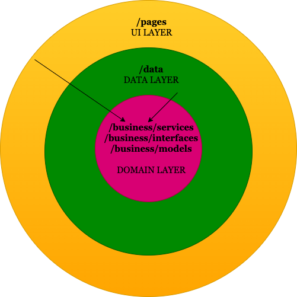

# Architecture

The UML attempts to provide a glimpse of the 3 layered architecture we've decided on. They are: 

- UI Layer
- Middle/Business Layer
- Data layer

Each of them ideally stay separate and decoupled. We acheive this using the **Domain Driven Design (DDD) paradigm**, where the core of the project is the domain (which is independent of all else), around which everything else, including the app layer and data layer circles, in the shape of an onion, giving the DDD paradigm its pseudonym called the *onion* architecture.

**Example of a typical onion architecture**

In our project, the UI layer only depends on the `QuizDataService`, which lies in the domain(middle) layer. The datalayer, which contains code that calls MongoDB apis, also depends on this same domain layer. Thus, we're able to make both the app layer and data layer independent of each other by making them function via the implementing the same interfaces. An object of the class QuizDataService is imported and made available to any caller who wants to call the datalayer to get the data it needs, without ever knowing anything about MongoDB. Thus, this data layer can be implemented using any db technology.

## How would we replace the database tech stack?

- For example, we'd make a `SQLServerQuizData` class that implements the same interfaces that currently is implemented by `MongoQuizData`(the concrete implementation that contains mongo code).
- Then, in dbservice(in the middle layer), we modify the body of the methods in `QuizDataService` class to use the `SQLServerQuizData` import (and property) instead of the `MongoQuizData` import.
- Thus by replacing what is returned form the middle layer(dbservice), the UI never needs to know the data layer implementation ever changed to use SQLServer.
