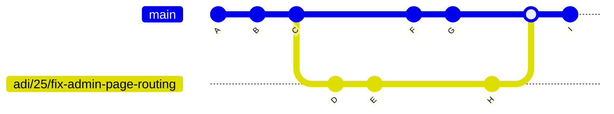
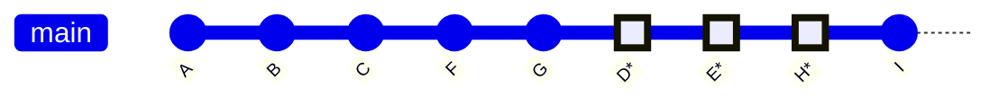

# Adithya Sudhan 202292768

- [Adithya Sudhan 202292768](#adithya-sudhan-202292768)
  - [Individual Tasks Done](#individual-tasks-done)
  - [Approaches](#approaches)
  - [State of Completion](#state-of-completion)
  - [Design Principles](#design-principles)
  - [Code Review Process](#code-review-process)

## Individual Tasks Done

As per the discussion with the team, I was assigned the following tasks.

- **Integration of front end with the backend** Since the team had arrived at acceptable front end pages, and had also formed an acceptable mongodb database design, I was assigned the [task](https://github.com/MUN-COMP6905/project-hteam/pull/51) of integrating them so that the /student page displays the contents stored in the MongoDb collection. This involved creating an API to serve the GET functionality needed to display quizes on the /student page and weaving it into the UI.

- **Adding a segregation data layer** Worked on separating the UI layer from the data layer. Although this [work](https://github.com/MUN-COMP6905/project-hteam/issues/65) is incomplete, it involved much discusson and analysis, resulting in a conceptual PR that, if anything, serves as a working copy of how the team can acheive segregation across the project.

- **Investigating possible vertical slice** As a start to the project, as team facilitator, I had to clone and try out several projects available publicly and understand the nuances of each so that I could find a template that uses the basic tech stack that the team agreed upon.

- **Meeting notes** [Recorded](https://github.com/MUN-COMP6905/project-hteam/pull/29) meeting notes for the first meeting and ensured that the team discussion was accurately captured.

- **Process and workflow** Although not an assigned issue, this was a necessary step toward enabling team progress. As team facilitator, it was my responsibility to ensure that the team had an agreeable process surrounding Git, Code reviews, Approvals, Merges and a Build and Deploy process. The only part of this captured on the board was the [format](https://github.com/MUN-COMP6905/project-hteam/issues/11) to be followed for user stories and bugs. A lot of work went into setting these up, aiding team members as and when necessary with demos and walkthroughs. Wrote the conventions outlined in the Team Processes readme file to showcase the final results of these efforts.

## Approaches

- Used Domain Driven Design to aid the team in design methodology.
- Facilitated team processes using examples wherever possible and drove a discussion around opposing alternatives. One example is the database design discussion.

```Json
{ //this is the collection (TABLE)
 {//this is a document for a Quiz(ROW) -- MATH
  quiztopic:string
  questions: 
  [
   {
        question: string,
        answer: string

   },
   {
        specialquestion: string,
        answer: string

   },
   .....
  ]
 },

 {//this is a document for a Quiz(ROW) -- SCIENCE
  quiztopic:string
  questions: 
  [
   {
        specialquestion: string,
        answer: string

   }
  
  ]
 }

}
```

vs

```Json
{ //this is the collection (TABLE)

 { //this is a document for a QuizItem(ROW)

      quiztopic:[topic1, topic2]
      question: string,
      answer: string,

 },
 {//this is another document for a QuizItem(ROW)

      quiztopic:[topic1]
      question: string,
      answer: string,

 },
 {//this is another document for a QuizItem(ROW)

      quiztopic: [topic1]
      question: string,
      answer: string,

 },
}
```

A team member suggested we use the former approach. By drawing out this example as seen above, I pointed out the pros and cons of either approach and ensured that our decision to go with the latter was based on full consensus after debating the two options. The latter means we'd need to filter many quizitems by a property in order to pull the questions in from the UI. Using the former approach means we'd only need a single call to get all the quiz specific questions, without filters. However, the tables turn when it comes to updates. If this project was a static page, like a general knowledge site, it might be preferable to use the former approach. But if we do so for a quiz project like this one, we'd have to update nested fields in MongoDB documents that will cause contention and, therefore, a slowdown at scale. To prevent this, it's better to have each quiz item situated separately and connected to the 'quiz' by a field like 'subject' for example.

## State of Completion

**Segregation layer** The current layer is yet to be functional and needs work before I can seperate UI code from mongodb specific calls
Other items assigned were completed.

## Design Principles

I adhered to SOLID priciples while reviewing PRs and making code changes. The team discussions were also aided by these principles and allowed the team to decide which tech stack was best to use. Domain Driven Design grealty influenced my approach to structuring the code and will inform the work items (to follow) that concern the business (middle) layer.

## Code Review Process

I insisted on codesandbox links from team members so that the code was sure to run, irrespective of our local machines. The team had also agreed to wait until everyone approved before any PR was merged.

## Git flow to suit codesandbox.io
The problem with our prior strategy around using codesandbox.io was that team members ended up only uploading/pushing their code onto codesandbox.io when they were done developing locally. This is non ideal for two reasons: codesandbox.io offers the ability to develop code online directly, which can reduce development time and encourage frequent testing. By making the git process around this convoluted, I inadvertently pushed the team away from codesandbox.io for development. As team facilitator, I also did not get around to writing a full fledged wiki on the git process, which probably made the process daunting for more than 1 team member. Therefore, this warrants a re-think and a detailed walkthrough of how to approach codesabox.io with git. The following explanation is supposed to solve this problem:

### Why the need for a rebase?
- Without a rebase: 


- After a rebase: 


As can be seen above, using a rebase keeps git history mostly linear and simple. It also helps resolve conflicts as and when the master branch has conflicting changes compared to the dev branch. Thus it is essential team members get comfortable doing rebases. 

### How to work with Git + CodeSandbox.io
1. Check out the latest master branch.
```
git checkout master
git pull
```
2. Make a new branch off master.
```
git checkout -b "<name>/<issue#>/<issue-description>"
```
3. 
```
git push <name-of-remote-public-repo>
```
4. Head over to codesandbox.io and open the sandbox correspondig to the public repo. 
5. Choose the correct dev branch name from the top panel. 
6. Make your code edits!
7. Once ready to commit, commit only the relevant changes from the left side git panel on codesandbox.io. This will make the commits on the remote version of your public repo's dev branch. 
8. Do the following to get those commits to your local machine: 
```
git pull <name-of-remote-public-repo> "<name>/<issue#>/<issue-description>" --rebase
```
9. 
```
git push origin 
```
- If you get back a prompt that encourages the following, then run that. It will push the local branch to your private h-team repo for the first time. Thereafter, step 9 alone would be enough. 
```
git push --set-upstream origin <name>/<issue#>/<issue-description>
```

10. Make further edits on codesandbox.io directly, commit them as mentioned in Step 7. Repeat steps 8 and 9. Observe that the commits appear on the private h-team Git repo. 