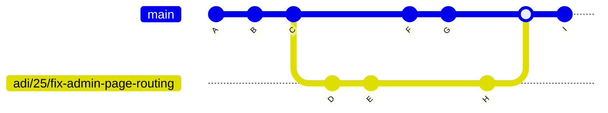

### Why the need for a rebase?
- Without a rebase: 


- After a rebase: 


As can be seen above, using a rebase keeps git history mostly linear and simple. It also helps resolve conflicts as and when the master branch has conflicting changes compared to the dev branch. Thus it is essential team members get comfortable doing rebases. 

### How to set up remotes for private and public repos? :bowtie:
- To know whsat remotes you currently have locally set up, run ```git remote```
- These are the shorthand names to the remote repos that your machine knows how to connect to. Usually one of these is the 'main' repo, which in our case, is the h-team private repo. Therefore, lets call this one's shorthand 'origin'. Here's how you can add the private h-team repo as a remote with the shorthand 'origin' onto your machine:
```git remote add origin https://github.com/MUN-COMP6905/project-hteam.git```
- Similarly, one can add another repo as another remote. In our case, we require a public git repo to be added. :exclamation: You must create this manually __only once__ - to be used for _all_ codesandbox development using different branches in the same public repo. The following will add this public repo under the shorthand 'dev':
```git remote add dev <likn-to-your-public-github-repo>```
- Run ```git remote``` again and observe that both origin and dev remotes now exist on your local machine. We will be using the dev remote to do development and as and when necessary, you will be able to push your code from your local branch to the origin remote. 
- This is key advantage of this approach: __one__ local dev branch can used alongside __two__ remote repos. Thus we can leverage the free version of codesandbox and still push that same code to our private repo for PR review. 

### How to work with Git + CodeSandbox.io :bowtie:
- Make sure to set up the 'remote' repos for both your private h-team repo as well as public repo before following these steps below. 
1. Check out the latest master branch.
```
git checkout master
git pull
```
2. Make a new branch off master.
```
git checkout -b "<name>/<issue#>/<issue-description>"
```
3. 
```
git push <name-of-remote-public-repo>
```
4. Head over to codesandbox.io and open the sandbox correspondig to the public repo. 
5. Choose the correct dev branch name from the top panel. 
6. Make your code edits!
7. Once ready to commit, commit only the relevant changes from the left side git panel on codesandbox.io. This will make the commits on the remote version of your public repo's dev branch. 
8. Do the following to get those commits to your local machine: 
```
git pull <name-of-remote-public-repo> "<name>/<issue#>/<issue-description>" --rebase
```
9. 
```
git push origin 
```
- If you get back a prompt that encourages the following, then run that. It will push the local branch to your private h-team repo for the first time. Thereafter, ```git push origin``` alone would be enough. 
```
git push --set-upstream origin <name>/<issue#>/<issue-description>
```

10. Make further edits on codesandbox.io directly, commit them as mentioned in Step 7. Repeat steps 8 and 9. Observe that the commits appear on the private h-team Git repo. 